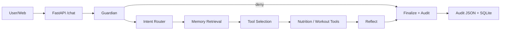

# DailyFit Agent

DailyFit Agent is a vertical fitness and nutrition AI agent focused on
engineering boundaries: source-attributed nutrition tools, long-term memory,
health-safety Guardian decisions, Aliyun Bailian OpenAI-compatible LLM/Judge
integration, JSON audits, real-data benchmarks, and a usable web UI.

## Quickstart

```bash
python -m pip install -e .
python backend/scripts/init_db.py
uvicorn backend.app:app --port 8000
```

Open [http://localhost:8000](http://localhost:8000).

## Live Mode Setup

Create a local `.env` outside git or export variables in your shell. Never
commit real keys.

```bash
set DAILYFIT_MODE=live
set DASHSCOPE_API_KEY=your_local_key
set DASHSCOPE_BASE_URL=https://dashscope.aliyuncs.com/compatible-mode/v1
```

All chat, judge, and embedding calls use provider `aliyun_openai`.

## Architecture



## Benchmark Results

<!-- BENCHMARK_TABLE_START -->
| Benchmark | Mode | Samples | Metric | Value |
|---|---:|---:|---|---:|
| Nutrition v2 | live_real | 53 | meal_kcal_mae | 156.55 |
| Guardian v2 | live_real | 65 | precision/recall | 0.9655/0.6222 |
| Memory v2 | live_real | 30 | hit_rate@3 | 0.5667 |
| E2E v2 | live_real | 30 | judge_pass_rate | 0.0 |
<!-- BENCHMARK_TABLE_END -->

## Cost Report

<!-- COST_REPORT_START -->
- Mode: demo_mock
- Total live cost USD: 0.0
- Cache hit rate: 0.0
- Budget exceeded: no
<!-- COST_REPORT_END -->

## Safety And Data Policy

- Nutrition numbers come from Open Food Facts, USDA FDC, HPB/FOCOS cached
  manual data, or explicit local fallback.
- The LLM is never allowed to invent nutrition ground truth or exercise data.
- Guardian verdicts are `allow`, `warn`, `require_confirmation`, or `deny`.
- Demo and live modes are labeled in API responses, audit JSON, benchmark JSON,
  and the web UI.
- Any fallback is explicit and auditable.
- This is not a medical diagnosis tool.

## Documentation

See `docs/` for architecture, data sources, benchmark design, memory design,
Guardian policy, self-audit, and interview notes.


## All Benchmark Modes

<!-- BENCHMARK_ALL_MODES_START -->
| Benchmark | Mode | Samples | Metric | Value |
|---|---:|---:|---|---:|
| E2E v2 | live_real | 30 | judge_pass_rate | 0.0 |
| E2E v2 | demo_mock | 30 | judge_pass_rate | 1.0 |
| Guardian v2 | live_real | 65 | precision/recall | 0.9655/0.6222 |
| Guardian v2 | demo_mock | 65 | precision/recall | 0.9655/0.6222 |
| Memory v2 | live_real | 30 | hit_rate@3 | 0.5667 |
| Memory v2 | demo_mock | 30 | hit_rate@3 | 0.5667 |
| Nutrition v2 | live_real | 53 | meal_kcal_mae | 156.55 |
| Nutrition v2 | demo_mock | 53 | meal_kcal_mae | 160.3 |
<!-- BENCHMARK_ALL_MODES_END -->
